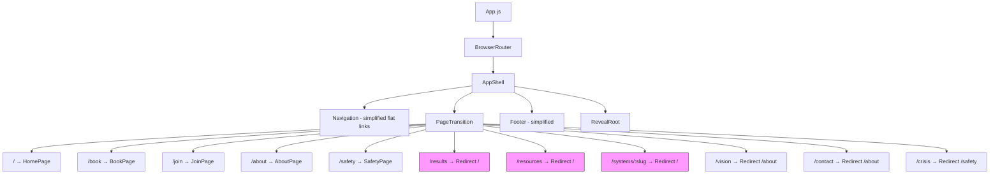

# Design Document: Conversion-Focused Simplification

## Overview

This design describes the radical simplification of the Malumz website from 7+ pages down to exactly 5 pages, with every page focused on a single clear call-to-action. The implementation removes unused components, simplifies navigation, restructures page layouts, and updates routing — all while preserving the existing E1 editorial design system, GSAP animations (scroll reveals, counter, parallax), and the Yoco-powered purchase flow.

The guiding principle: every element on every page must directly serve one of three conversions — buy the book, join a circle, or get crisis help. Content that doesn't serve a conversion is removed.

### Key Design Decisions

1. **Redirect-first removal**: Removed routes (`/results`, `/resources`, `/systems/:slug`) redirect to `/` rather than showing 404s, preserving any existing bookmarks or shared links.
2. **Component deletion over hiding**: Unused components (Marquee, StoryBridge, TrainerConnector, HorizontalTrainers, PullQuote) are fully removed from the codebase rather than conditionally hidden, reducing bundle size.
3. **Form simplification via field reduction**: The JoinPage form drops from 4+ fields with model selection to 3 fields (Name, Email, City/Area) with a single submit, reducing friction.
4. **Purchase-first layout**: BookPage moves the BookPurchasePanel immediately below the hero, removing the video hero strip and signed copy form to put the conversion action above the fold.
5. **Flat navigation**: The dropdown "Learn" category is removed entirely; all nav items are flat links, reducing cognitive load and click depth.

## Architecture

The architecture remains a single-page React application with React Router v6. The change is purely subtractive — no new architectural patterns are introduced.



### Route Changes Summary

| Current Route | Action | Target |
|---|---|---|
| `/` | Keep | HomePage (simplified) |
| `/book` | Keep | BookPage (restructured) |
| `/join` | Keep | JoinPage (simplified form) |
| `/about` | Keep | AboutPage (content reduced) |
| `/safety` | Keep | SafetyPage (streamlined) |
| `/results` | Redirect | `/` |
| `/resources` | Redirect | `/` |
| `/systems/:slug` | Redirect | `/` |
| `/systems` | Redirect | `/` (was `/resources`) |
| `/vision` | Redirect | `/about` (unchanged) |
| `/contact` | Redirect | `/about` (unchanged) |
| `/crisis` | Redirect | `/safety` (unchanged) |

## Components and Interfaces

### Components to Remove

| Component | File | Reason |
|---|---|---|
| `HorizontalTrainers` | `components/home/HorizontalTrainers.js` | Heavy scroll-pin section, no conversion value |
| `TrainerConnector` | `components/home/TrainerConnector.js` | SVG radial diagram, decorative only |
| `StoryBridge` | `components/home/StoryBridge.js` | Two-column filler content |
| `Marquee` | `components/Marquee.js` | Infinite loop ribbon, no conversion value |
| `PullQuote` | `components/home/PullQuote.js` | Full-bleed blockquote, decorative |
| `ResultsPage` | `pages/ResultsPage.js` | Entire page removed |
| `ResourcesPage` | `pages/ResourcesPage.js` | Entire page removed |
| `SystemDetailPage` | `pages/SystemDetailPage.js` | Entire page removed |

### Components to Modify

#### Navigation (`components/Navigation.js`)

**Before:**
```javascript
const navLinks = [
  { name: 'Home', path: '/' },
  { name: 'The Book', path: '/book' },
  { name: 'Start a Circle', path: '/join' },
  { name: 'Learn', children: [{ name: 'Resources', path: '/resources' }, { name: 'Results', path: '/results' }] },
  { name: 'About', path: '/about' },
  { name: 'Safety', path: '/safety' },
];
```

**After:**
```javascript
const navLinks = [
  { name: 'Home', path: '/' },
  { name: 'Book', path: '/book' },
  { name: 'Join', path: '/join' },
  { name: 'About', path: '/about' },
];
```

- Remove `ChevronDown` import
- Remove `openDropdown` state and dropdown rendering logic
- Keep "I Need Help" CTA button linking to `/safety`
- Remove all dropdown-related mouse event handlers

#### Footer (`components/Footer.js`)

**After:** Single-column or two-column layout with:
- Links to all 5 pages: Home, Book, Join, About, Safety
- Email address (nkosinathi.dhliso@gmail.com)
- Social media links (Instagram, LinkedIn)
- Remove "Learn" column, "Crisis Help" column content categories, resource links, vision roadmap links
- Retain CursorSettingsToggle

#### HomePage (`pages/HomePage.js`)

**After structure:**
```
Hero (pitch + dual CTAs + crisis button) → Optional single testimonial/stat
```

- Remove imports: `TrainerConnector`, `HorizontalTrainers`, `PullQuote`, `StoryBridge`, `Marquee`, `ScrollIndicator`
- Remove `sixTrainers`, `pilotStats`, `HOME_MARQUEE_PHRASES`, `CONNECTOR_LABELS` constants
- Keep `HeroSection` (with parallax) — modify to include dual CTAs ("Buy the Book" → `/book`, "Join a Circle" → `/join`) and a visible crisis button
- Add max one testimonial or social proof stat below hero
- Retain `.gs-reveal` classes and scroll reveal participation

#### BookPage (`pages/BookPage.js`)

**After structure:**
```
Minimal hero (title + subtitle, no video) → BookPurchasePanel → Brief chapter preview
```

- Remove video hero strip (the `<NotchedSection>` with `<video>`)
- Remove "Request a Signed Copy" form section (the `FloatingField` form)
- Remove separate "Audiobook Access" section (audiobook is already in `BookPurchasePanel`)
- Keep `BookPurchasePanel` as first content section below a simple text hero
- Keep chapter listing with `.gs-reveal` animations (condensed)
- Remove `FloatingField` component, `LABEL_LIFT_VARS`, `LABEL_REST_VARS`, `ARROW_HOVER_VARS`, `ARROW_REST_VARS` constants (only needed for the removed form)

#### JoinPage (`pages/JoinPage.js`)

**After structure:**
```
One-sentence explanation → 3-field form (Name, Email, City/Area) → Submit → Confirmation
```

- Remove "Choose Your Model" section (model A/B selection buttons)
- Remove "How to Start Your Circle" 7-step process
- Remove "Download the Starter Pack" section
- Remove `selectedModel` state, `steps` constant
- Simplify form to 3 fields: Name, Email, City/Area
- Remove Circle Model dropdown
- Change label from "Facilitator Name" to "Name"
- Keep `submitContact` API integration
- Keep success confirmation message
- Keep `.gs-reveal` on heading

#### AboutPage (`pages/AboutPage.js`)

**After structure:**
```
Hero → Counter + 3 paragraphs founder story → Contact form
```

- Remove "The Story" timeline section
- Remove "The Roadmap" vision timeline section
- Remove "Formal Infrastructure Vision" section
- Remove "Malumz Network" requirements section
- Remove anti-predator protocols section
- Remove policy recommendations content
- Remove editorial collage section
- Keep counter animation (COUNTER_TARGET = 200)
- Keep pull-quote paragraphs (max 3, already 3)
- Keep contact form at bottom
- Keep `.gs-reveal` and scroll reveal animations
- Remove unused imports: `Calendar`, `Heart`, `TrendingUp`, `Building2`, `Users`, `FileText`, `MapPin`
- Remove unused constants: `timelineEvents`, `TIMELINE`, `infrastructureItems`, `malumzRequirements`, `antiPredatorProtocols`, `COLLAGE_ITEMS`
- Remove unused asset imports: `ABOUT_COLLAGE_A/B/C`, `VISION_NODE_1/2/3`

#### SafetyPage (`pages/SafetyPage.js`)

**After structure:**
```
Crisis hero ("You Are Not Alone" + Lifeline CTA) → Emergency numbers (tappable tel links) → SADAG link → Anonymous report form
```

- Remove provincial resources accordion (`provinces` data + `<details>` section)
- Remove "Trained Tyrant Profile" section (`tyrantSigns` data)
- Remove "Silent Exclusion Guide" section
- Remove "Facilitator Vetting Checklist" section (`vettingChecklist` data)
- Remove "Safety" secondary hero and "The Non-Negotiable" section
- Add single SADAG website link for provincial resources
- Keep crisis hero with "You Are Not Alone" messaging and Lifeline CTA
- Keep emergency numbers grid (tappable `tel:` links)
- Keep anonymous report form
- Keep `.gs-reveal` animations

### Components Retained (No Changes)

| Component | Reason |
|---|---|
| `BookPurchasePanel` | Core conversion component (eBook R99 / Audiobook R199) |
| `NotchedSection` | Layout primitive used across all pages |
| `MagneticButton` | Interaction primitive for CTAs |
| `PageTransition` | Route transition animation |
| `RevealRoot` | Global scroll-reveal batch manager |
| `Cursor` | Custom cursor experience |
| `CursorSettingsToggle` | Accessibility toggle in footer |

## Data Models

No data model changes are required. The existing `submitContact` API helper continues to serve:
- JoinPage interest form (Name, Email, City/Area submitted as contact)
- AboutPage contact form (Name, Email, Subject, Message)
- SafetyPage anonymous report form (anonymous message)

### JoinPage Form Data (Simplified)

```javascript
// Before
{ name: '', email: '', location: '', model: 'standard' }

// After
{ name: '', email: '', location: '' }
```

The `model` field is removed. The API submission subject changes from `"Circle Registration - Model A/B"` to a simpler `"Brotherhood Circle Interest"`.

## Error Handling

No new error handling patterns are introduced. Existing patterns are preserved:

1. **Form submission errors**: `try/catch` with `console.error` + user-facing `alert()` fallback
2. **API failures**: Graceful degradation with error message display
3. **404/removed routes**: All removed routes redirect via `<Navigate to="..." replace />` — no 404 page needed
4. **Image load failures**: Existing `onError` handlers swap to `e1-surface` placeholder (retained on AboutPage for counter section)

## Testing Strategy

### Why Property-Based Testing Does Not Apply

This feature is a UI restructuring and content removal task. The changes are:
- Removing components from render trees (declarative JSX changes)
- Simplifying form fields (static field reduction)
- Updating navigation link arrays (static data changes)
- Configuring route redirects (declarative routing)

None of these involve pure functions with variable input spaces, parsers, serializers, or algorithms where universal properties would hold across generated inputs. The acceptance criteria are all "SHALL render X" / "SHALL NOT render X" assertions best verified with example-based component tests.

### Testing Approach

**Unit Tests (React Testing Library)**:
- Verify each page renders its required elements (CTAs, forms, crisis numbers)
- Verify each page does NOT render removed sections
- Verify Navigation renders exactly 4 flat links + crisis button, no dropdown
- Verify Footer renders links to all 5 pages + email + social links
- Verify JoinPage form has exactly 3 fields and submits successfully
- Verify SafetyPage crisis numbers are tappable `tel:` links
- Verify BookPage renders `BookPurchasePanel` as first content section

**Integration Tests (React Router)**:
- Verify `/results` redirects to `/`
- Verify `/resources` redirects to `/`
- Verify `/systems/any-slug` redirects to `/`
- Verify `/vision` redirects to `/about`
- Verify `/contact` redirects to `/about`
- Verify `/crisis` redirects to `/safety`

**Visual/Manual Tests**:
- Verify each page is scannable in under 30 seconds (subjective)
- Verify primary CTA is above the fold on each page
- Verify scroll reveal animations still fire on retained content
- Verify counter animation still works on AboutPage
- Verify parallax hero still works on HomePage

**Bundle Size Verification**:
- Confirm removed components are not present in production build
- Measure bundle size reduction after component deletion
