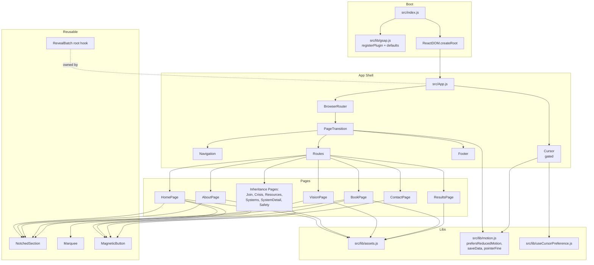
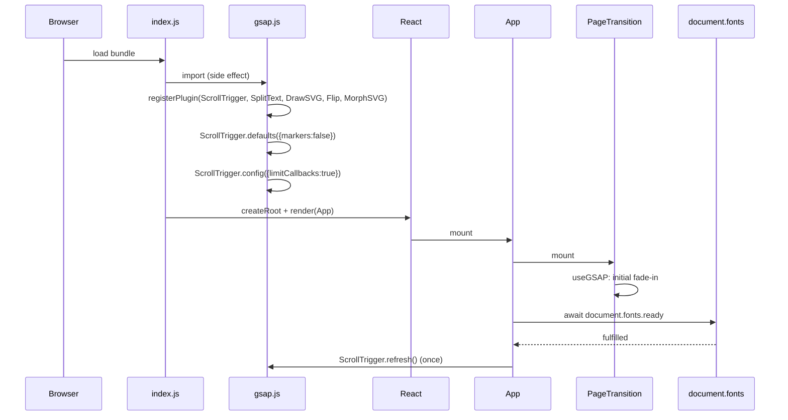
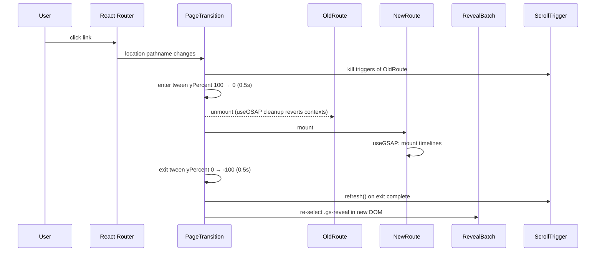

# Design Document

## Overview

This design realizes the **E1 Editorial UI Overhaul** specified in the requirements. It replaces the existing `malumz-*` Tailwind token surface, Inter/Playfair/Merriweather typography, and flat section layouts with a coordinated editorial system built around:

- A seven-token E1 palette (`e1-bg`, `e1-primary`, `e1-secondary`, `e1-highlight`, `e1-text`, `e1-text-muted`, `e1-surface`) that is charcoal-led with terracotta accents.
- A Fraunces (display, variable axis) + DM Sans (body) type system loaded from a single Google Fonts link with `document.fonts.ready` used to drive one `ScrollTrigger.refresh()` per page load.
- A reusable `<NotchedSection>` layout primitive that renders a 40px-rounded rectangle with concave top and bottom notches (≈ 220 × 55 px). A CSS `mask-image` data URL is the primary implementation; an SVG `clipPath` with a `ResizeObserver`-driven path recalculation is the fidelity fallback.
- A single, shared GSAP runtime initialized once at app boot (`frontend/src/lib/gsap.js`) that registers `ScrollTrigger`, `SplitText`, `DrawSVGPlugin`, `Flip`, and `MorphSVGPlugin`. All components consume GSAP exclusively through `@gsap/react`'s `useGSAP` hook so scoping and cleanup are inherited from the library rather than hand-rolled.
- Eight coordinated animation systems — Reveal Batch, Hero SplitText + Flip card + Ambient video, Marquee, MagneticButton, Trainer Connector (DrawSVG), Trainer Spotlight (pinned scrub), Pull-Quote rule draw, and the PageTransition curtain — each gated by a layered policy of `prefers-reduced-motion`, `navigator.connection.saveData`, pointer capability, and a 1024px shared pin breakpoint.
- An opt-in custom cursor (`<Cursor>`) with a dot + ring design, persisted preference in the localStorage key `e1.cursor.custom` (default `"off"`), native cursor preserved otherwise.
- A `PageTransition` terracotta curtain that wraps `<Routes>` and drives the route change via `yPercent` sweeps, followed by a single `ScrollTrigger.refresh()` after the exit sweep.
- A canonical `frontend/src/lib/assets.js` module that exports semantic constants (`HERO_CARD_IMAGE`, `HERO_AMBIENT_VIDEO`, `ABOUT_COLLAGE_A`, etc.) plus a default export with `width`, `height`, `type`, and `altPlaceholder` metadata. Every page imports through semantic names; raw `/Assets/` URLs are disallowed.

The overhaul is strictly presentational: routing, page filenames, page-level data, navigation/footer structure, and backend endpoints are untouched (Requirement 30). The Navigation and Footer components are restyled in place but retain their structure and link set.

### Scope Framing

- **In scope:** Tailwind token set, typography config and font loading, GSAP runtime, Assets module, NotchedSection primitive, Cursor + PageTransition + Marquee + MagneticButton + Reveal Batch reusable components, HomePage editorial treatments (hero SplitText / Flip card / ambient video / Trainer Connector / Trainer Spotlight / Pull-Quote / Marquee / Scroll indicator), per-page editorial treatments for AboutPage / VisionPage / BookPage / ContactPage / ResultsPage, NotchedSection + Reveal Batch inheritance for JoinPage / CrisisPage / ResourcesPage / SystemsPage / SystemDetailPage / SafetyPage, Navigation/Footer restyling, a cursor preference toggle, reduced-motion + save-data + pointer-capability gating, GSAP cleanup discipline, media dimension discipline, Lighthouse budgets, accessibility baseline, and graceful fallbacks for missing assets.
- **Out of scope:** Route changes, page filenames, page copy, backend, analytics, i18n, final alt copy, icon replacement.

### Key Design Decisions And Rationales

1. **Single GSAP runtime module, imported before React renders.** GSAP plugin registration has global side effects; performing it twice is wasteful and permitted to produce console warnings. Importing `src/lib/gsap.js` from `src/index.js` before `ReactDOM.createRoot().render(...)` guarantees the side effect runs exactly once per page load and that every downstream import observes already-registered plugins (Requirement 3). All components author animations through `useGSAP()` (Requirement 3.7 / 34.1) rather than ad-hoc `useEffect` + `gsap.context()` pairs. The hook integrates cleanup with React's commit lifecycle, which makes Requirement 34 ("every animation must clean up on unmount") a library invariant rather than an author-policed discipline.
2. **`gsap.matchMedia()` as the single motion-gate.** Every timeline that transforms layout lives inside `gsap.matchMedia().add("(prefers-reduced-motion: no-preference)", …)`. Reduced-motion fallbacks (opacity-only 150 ms crossfades, static marquee, unpinned spotlight, video → poster swap) are authored as the negative branch of the same matchMedia container. This concentrates motion policy in one place per component and makes the matrix testable (Requirement 4).
3. **Assets module gates every media reference.** Raw `/Assets/...` URLs are forbidden in component code. A single source (`src/lib/assets.js`) maps twelve physical files to semantic names and carries `width`, `height`, `type`, and `altPlaceholder` metadata (Requirement 5). A build-time lint rule and an import-time unit test both enforce this. Centralization lets us (a) rewrite paths without a global sweep, (b) retire placeholder alt copy centrally once content lands, and (c) guarantee every ``/`<video>` has declared dimensions (Requirement 32).
4. **NotchedSection: `mask-image` primary, SVG `clipPath` fallback.** `mask-image` with an inline SVG data URL is the cheapest approach and produces a paint-only silhouette with no per-frame JavaScript. However, browsers differ in how they interpolate `mask-size: 100% 100%` against fractional `stretch` dimensions, so a `ResizeObserver`-driven `clipPath` fallback is available behind a `force="svg"` prop and is auto-selected on user agents that fail a capability probe. The fallback throttles DOM writes through `requestAnimationFrame` to stay within one write per frame (Requirement 7.9).
5. **Pin breakpoint policy: one shared 1024px threshold.** Every `ScrollTrigger.pin` uses `ScrollTrigger.matchMedia({ "(min-width: 1024px) and (prefers-reduced-motion: no-preference)": … })`. On resize, a debounced handler calls `ScrollTrigger.refresh()` within 250 ms of settle (Requirement 22.3). This keeps tablet and mobile viewports scroll-unencumbered and avoids the 300vh trapped-scroll problem that pins introduce.
6. **Cursor default "off".** The `e1.cursor.custom` localStorage key defaults to `"off"` so first-visit users keep their OS cursor (Requirement 6.2). A visible settings toggle enables opt-in. The cursor is additionally gated by `(pointer: fine) and (hover: hover)` and by `prefers-reduced-motion` (Requirements 6.7, 4.7).
7. **PageTransition as the single source of route-change orchestration.** The curtain wraps `<Routes>` and owns (a) the `yPercent` sweep, (b) the crossfade between old and new route content, and (c) the follow-on `ScrollTrigger.refresh()`. Other components do not schedule refreshes on route change — they rely on PageTransition, and secondarily on a `useEffect([pathname])` in the app shell (Requirements 9, 21).

### High-Level Architecture Diagram



---

## Architecture

### Module Layout

All new modules live under `frontend/src/` and reuse the existing `@/` craco alias.

```
frontend/src/
├── App.js                             (modified: wrap Routes in PageTransition, mount Cursor)
├── index.js                           (modified: import '@/lib/gsap' before render)
├── index.css                          (modified: fonts, body bg → e1-bg, reduced-motion CSS)
├── App.css                            (unchanged unless dead)
├── components/
│   ├── Navigation.js                  (modified: restyled only)
│   ├── Footer.js                      (modified: restyled only)
│   ├── ImagePreloader.js              (unchanged)
│   ├── NotchedSection.js              (new)
│   ├── Cursor.js                      (new)
│   ├── PageTransition.js              (new)
│   ├── Marquee.js                     (new)
│   ├── MagneticButton.js              (new)
│   ├── RevealRoot.js                  (new; mounts the global Reveal Batch hook)
│   ├── CursorSettingsToggle.js        (new)
│   └── home/
│       ├── HeroSection.js             (new; composes SplitText + Flip card + ambient video)
│       ├── TrainerConnector.js        (new)
│       ├── TrainerSpotlight.js        (new)
│       ├── PullQuote.js               (new)
│       └── ScrollIndicator.js         (new)
├── lib/
│   ├── gsap.js                        (new; singleton registration)
│   ├── assets.js                      (new; semantic constants + default metadata)
│   ├── motion.js                      (new; prefers-reduced-motion, save-data, pointer capability)
│   ├── useCursorPreference.js         (new; localStorage hook)
│   ├── useRevealBatch.js              (new; ScrollTrigger.batch per-pathname)
│   └── useRouteScrollRefresh.js       (new; wraps ScrollTrigger.refresh on pathname change)
└── pages/
    ├── HomePage.js                    (modified: composes new hero + sections)
    ├── AboutPage.js                   (modified: counter + collage)
    ├── VisionPage.js                  (modified: vertical timeline)
    ├── BookPage.js                    (modified: bottom-border form + accent video)
    ├── ContactPage.js                 (modified: bottom-border form)
    ├── ResultsPage.js                 (modified: testimonial reel)
    ├── JoinPage.js                    (modified: NotchedSection + .gs-reveal)
    ├── CrisisPage.js                  (modified: NotchedSection + .gs-reveal)
    ├── ResourcesPage.js               (modified: NotchedSection + .gs-reveal)
    ├── SystemsPage.js                 (modified: NotchedSection + .gs-reveal)
    ├── SystemDetailPage.js            (modified: NotchedSection + .gs-reveal)
    └── SafetyPage.js                  (modified: NotchedSection + .gs-reveal)
```

Test files mirror the source under `frontend/src/__tests__/` and `frontend/src/lib/__tests__/`.

### Boot Sequence



### Route Change Sequence



### Motion Gating Decision Matrix

The three environmental signals — reduced motion, save-data, pointer capability — and the shared 1024px breakpoint feed a central policy that every animation consults:

| Animation                       | reduced-motion       | save-data            | pointer-fine + hover     | viewport ≥ 1024px |
|---------------------------------|----------------------|----------------------|--------------------------|-------------------|
| Reveal Batch                    | opacity only, 150 ms | no effect            | no effect                | no effect         |
| Hero SplitText                  | opacity only, 150 ms | no effect            | no effect                | no effect         |
| Hero Flip card entry            | opacity only, 150 ms | no effect            | no effect                | no effect         |
| Hero Flip card idle float       | disabled             | no effect            | no effect                | no effect         |
| Hero ambient video              | static poster        | static poster        | no effect                | no effect         |
| Trainer Connector               | drawn-fully-static   | no effect            | no effect                | no effect         |
| Trainer Spotlight pin           | disabled (sequential)| no effect            | no effect                | required (else sequential) |
| Pull-Quote rule draw            | opacity only, 150 ms | no effect            | no effect                | no effect         |
| Marquee                         | static               | no effect            | hover slows / resumes    | no effect         |
| MagneticButton                  | disabled             | no effect            | required (else inert)    | no effect         |
| PageTransition curtain          | opacity 150 ms xfade | no effect            | no effect                | no effect         |
| Cursor                          | not mounted          | no effect            | required (else not mnt.) | no effect         |
| Hero scroll indicator bob       | static               | no effect            | no effect                | no effect         |
| Book/Contact input label lift   | opacity only, 150 ms | no effect            | no effect                | no effect         |
| Book arrow slide on hover       | disabled             | no effect            | required (else inert)    | no effect         |
| About counter                   | render final value   | no effect            | no effect                | no effect         |
| About per-word pull-quote       | opacity only, 150 ms | no effect            | no effect                | no effect         |
| Vision vertical timeline draw   | drawn-fully-static   | no effect            | no effect                | no effect         |
| Results testimonial reel        | paused on mount      | no effect            | no effect                | no effect         |

The matrix is codified in `src/lib/motion.js` helpers (`prefersReducedMotion()`, `isSaveData()`, `isPointerFineHover()`, `isDesktopPin()`) and in a shared `gsap.matchMedia().add()` pattern documented below.

---

## Components And Interfaces

### Conventions

- **Language & tooling:** JavaScript (CRA + craco), React 18, React Router v6. No TypeScript; rely on JSDoc on public components.
- **Alias:** `@/` resolves to `frontend/src/` (existing craco setup).
- **GSAP usage:** Always through `useGSAP(() => { ... }, { scope: ref })`. Components never call `gsap.context()` directly or attach manual listeners.
- **Cleanup:** `useGSAP` auto-reverts the scoped context on unmount. For window/document listeners, components return cleanup functions from `useEffect` or use `{ signal: controller.signal }` with an `AbortController`.
- **Reduced motion:** Every timeline is authored inside `gsap.matchMedia().add("(prefers-reduced-motion: no-preference)", fn)` and a companion `gsap.matchMedia().add("(prefers-reduced-motion: reduce)", reducedFn)` where a fallback is required.

### 1. `src/lib/gsap.js` — GSAP Runtime

```js
import { gsap } from "gsap";
import { ScrollTrigger } from "gsap/ScrollTrigger";
import { SplitText } from "gsap/SplitText";
import { DrawSVGPlugin } from "gsap/DrawSVGPlugin";
import { Flip } from "gsap/Flip";
import { MorphSVGPlugin } from "gsap/MorphSVGPlugin";

gsap.registerPlugin(ScrollTrigger, SplitText, DrawSVGPlugin, Flip, MorphSVGPlugin);
ScrollTrigger.defaults({ markers: false });
ScrollTrigger.config({ limitCallbacks: true });

export { gsap, ScrollTrigger, SplitText, DrawSVGPlugin, Flip, MorphSVGPlugin };
```

Imported once by `src/index.js` before the React tree is rendered (Requirement 3.6). A unit test asserts that importing the module registers plugins exactly once via a spy on `gsap.registerPlugin`.

### 2. `src/lib/assets.js` — Assets Module

```js
// Paths (public/Assets/…) reference request-time URLs served by CRA.
export const HERO_CARD_IMAGE =
  "/Assets/WhatsApp Image 2026-05-12 at 17.07.49.jpeg";
export const HERO_POSTER_IMAGE =
  "/Assets/WhatsApp Image 2026-05-12 at 17.07.49 (1).jpeg";
export const HERO_AMBIENT_VIDEO =
  "/Assets/WhatsApp Video 2026-05-12 at 17.06.20.mp4";

export const ABOUT_COLLAGE_A =
  "/Assets/WhatsApp Image 2026-05-12 at 16.54.55.jpeg";
export const ABOUT_COLLAGE_B =
  "/Assets/WhatsApp Image 2026-05-12 at 16.54.55 (1).jpeg";
export const ABOUT_COLLAGE_C =
  "/Assets/WhatsApp Image 2026-05-12 at 16.54.56.jpeg";

export const VISION_NODE_1 =
  "/Assets/WhatsApp Image 2026-05-12 at 16.54.56 (1).jpeg";
export const VISION_NODE_2 =
  "/Assets/WhatsApp Image 2026-05-12 at 16.54.56 (2).jpeg";
export const VISION_NODE_3 =
  "/Assets/WhatsApp Image 2026-05-12 at 17.07.49 (2).jpeg";

export const BOOK_ACCENT_VIDEO =
  "/Assets/WhatsApp Video 2026-05-12 at 17.07.50.mp4";
export const RESULTS_TESTIMONIAL_VIDEO =
  "/Assets/WhatsApp Video 2026-05-12 at 17.07.52.mp4";

// Metadata-rich default export. `width` and `height` are intrinsic pixel
// dimensions recorded at intake; the build fails if they drift from the
// physical files (see Testing Strategy).
const assets = {
  HERO_CARD_IMAGE: {
    src: HERO_CARD_IMAGE,
    width: 1200, height: 1600, type: "image/jpeg",
    altPlaceholder: "Portrait of a student seated against a terracotta wall",
  },
  HERO_POSTER_IMAGE: {
    src: HERO_POSTER_IMAGE,
    width: 1920, height: 1080, type: "image/jpeg",
    altPlaceholder: "Ambient poster frame of the E1 hero atmosphere",
  },
  HERO_AMBIENT_VIDEO: {
    src: HERO_AMBIENT_VIDEO,
    width: 1920, height: 1080, type: "video/mp4",
    altPlaceholder: "Ambient background video loop for the E1 hero",
  },
  ABOUT_COLLAGE_A: { src: ABOUT_COLLAGE_A, width: 1200, height: 1600, type: "image/jpeg",
    altPlaceholder: "Editorial collage frame A" },
  ABOUT_COLLAGE_B: { src: ABOUT_COLLAGE_B, width: 1200, height: 1600, type: "image/jpeg",
    altPlaceholder: "Editorial collage frame B" },
  ABOUT_COLLAGE_C: { src: ABOUT_COLLAGE_C, width: 1200, height: 1600, type: "image/jpeg",
    altPlaceholder: "Editorial collage frame C" },
  VISION_NODE_1: { src: VISION_NODE_1, width: 1200, height: 1200, type: "image/jpeg",
    altPlaceholder: "Vision timeline node portrait 1" },
  VISION_NODE_2: { src: VISION_NODE_2, width: 1200, height: 1200, type: "image/jpeg",
    altPlaceholder: "Vision timeline node portrait 2" },
  VISION_NODE_3: { src: VISION_NODE_3, width: 1200, height: 1200, type: "image/jpeg",
    altPlaceholder: "Vision timeline node portrait 3" },
  BOOK_ACCENT_VIDEO: { src: BOOK_ACCENT_VIDEO, width: 1920, height: 1080, type: "video/mp4",
    altPlaceholder: "Silent accent video above the Book form" },
  RESULTS_TESTIMONIAL_VIDEO: { src: RESULTS_TESTIMONIAL_VIDEO, width: 1920, height: 1080, type: "video/mp4",
    altPlaceholder: "Student testimonial reel" },
};
export default assets;
```

Notes:
- Exact dimensions are captured during intake from the twelve physical files and committed alongside this module; a unit test loads each image and video and asserts dimensions match.
- The pre-existing raw-`/Assets/` usage is banned by an ESLint `no-restricted-syntax` rule scoped to `frontend/src/**/*.{js,jsx}` (Requirement 5.9 / 32).

### 3. `src/lib/motion.js` — Motion Policy Helpers

```js
export const REDUCED_MOTION_QUERY = "(prefers-reduced-motion: reduce)";
export const POINTER_FINE_QUERY = "(pointer: fine) and (hover: hover)";
export const DESKTOP_PIN_QUERY = "(min-width: 1024px)";

export function prefersReducedMotion() {
  return typeof window !== "undefined" &&
    window.matchMedia(REDUCED_MOTION_QUERY).matches;
}
export function isPointerFineHover() {
  return typeof window !== "undefined" &&
    window.matchMedia(POINTER_FINE_QUERY).matches;
}
export function isDesktopPin() {
  return typeof window !== "undefined" &&
    window.matchMedia(DESKTOP_PIN_QUERY).matches;
}
export function isSaveData() {
  if (typeof navigator === "undefined") return false;
  const c = navigator.connection;
  return !!(c && c.saveData === true);
}
```

These are pure reads; they are synchronous and side-effect-free so they can be unit-tested with `matchMedia` mocks.

### 4. `src/lib/useCursorPreference.js` — Cursor Preference Hook

```js
import { useCallback, useEffect, useState } from "react";

export const CURSOR_KEY = "e1.cursor.custom";

function read() {
  try {
    return window.localStorage.getItem(CURSOR_KEY) === "on" ? "on" : "off";
  } catch { return "off"; }
}

export function useCursorPreference() {
  const [value, setValue] = useState(read);
  useEffect(() => {
    const onStorage = (e) => {
      if (e.key === CURSOR_KEY) setValue(read());
    };
    window.addEventListener("storage", onStorage);
    return () => window.removeEventListener("storage", onStorage);
  }, []);
  const setPreference = useCallback((next) => {
    const v = next === "on" ? "on" : "off";
    try { window.localStorage.setItem(CURSOR_KEY, v); } catch {}
    setValue(v);
  }, []);
  return [value, setPreference];
}
```

Default is `"off"` (Requirement 6.2) because any invalid, missing, or unreadable value normalizes to `"off"`.

### 5. `<NotchedSection>` Layout Primitive

**Props**

| Prop         | Type                              | Default       | Purpose |
|--------------|-----------------------------------|---------------|---------|
| `tone`       | `"charcoal"` \| `"sienna"`        | `"charcoal"`  | Background token (`e1-bg` or `e1-surface`). |
| `className`  | `string`                          | `undefined`   | Forwarded to the outer element. |
| `as`         | `React.ElementType`               | `"section"`   | Tag element. |
| `children`   | `React.ReactNode`                 | `undefined`   | Body content. |
| `force`      | `"mask"` \| `"svg"` \| `undefined`| `undefined`   | Force a specific silhouette implementation; when undefined, feature detection chooses. |

**Silhouette**

Shape parameters: outer radius 40 px; notch width ≈ 220 px; notch depth ≈ 55 px; notch centered on the horizontal midpoint of top and bottom edges.

- **Primary:** CSS `mask-image: url("data:image/svg+xml;utf8,<svg …>")` with `mask-size: 100% 100%` and `mask-repeat: no-repeat`. The SVG path is generated once at module load for a fixed `viewBox="0 0 1000 1000"` and sized with `preserveAspectRatio="none"`. The background fill is the tone token.
- **Fallback:** When `force === "svg"` or a capability probe detects a failing implementation (Safari < 15.4 `mask-image` inconsistencies), render an SVG overlay sibling with a `<clipPath id="…">` and apply `clip-path: url(#…)` to the outer element. A `ResizeObserver` recomputes the path on size change, scheduling writes through `requestAnimationFrame`. The observer asserts at most one DOM write per animation frame (Requirement 7.9).

**Accessibility**

The silhouette is purely decorative. Content inside `<NotchedSection>` is not clipped structurally from the accessibility tree; clip-path applies visually only. The element does not add a role or label.

### 6. `<Cursor>` Component

- **Gating:** Renders `null` unless `useCursorPreference()` returns `"on"`, `isPointerFineHover()` returns `true`, and `prefersReducedMotion()` returns `false`.
- **DOM:** Two `<div>`s at `position: fixed` with `pointer-events: none` and `z-index: 480` (below `PageTransition`). Dot is 12 × 12, background `e1-primary`. Ring is 40 × 40, border 1 px `e1-primary`.
- **Movement:** Pointer listener attached to `window` (`pointermove` with `{ passive: true }`). Dot updates with `gsap.set(dotEl, { x, y })` on the same frame; ring updates via `gsap.to(ringEl, { x, y, duration: 0.5, ease: "power3.out", overwrite: "auto" })`.
- **Hover amplification:** A delegated `pointerover`/`pointerout` listener on the document checks `closest('a, button, [data-cursor-hover]')`. On match, tween the dot to `{ scale: 2.5, backgroundColor: "#F0E2CB", duration: 0.2 }`; on leave, tween back to `{ scale: 1, backgroundColor: "#C2491A", duration: 0.2 }`.
- **Root cursor:** While `<Cursor>` is mounted, set `document.documentElement.style.cursor = "none"`. On unmount, restore.
- **Focus rings:** Never mutate `outline` or `box-shadow` on focus targets (Requirement 33.4).

### 7. `<PageTransition>` Component

- **Structure:** A fixed full-viewport curtain `div` colored `e1-primary`, plus a wrapper `div` that hosts the current route content. The component consumes `useLocation` and tracks a `displayLocation` state used for a two-phase crossfade.
- **Tween sequence:**
  1. On pathname change, start an enter tween on the curtain: `yPercent: 100 → 0` over 0.5 s (`power3.inOut`).
  2. On enter complete, swap `displayLocation` to the new pathname (this crossfades the outgoing route to the incoming route DOM).
  3. Kick an exit tween: `yPercent: 0 → -100` over 0.5 s.
  4. On exit complete, call `ScrollTrigger.refresh()` exactly once.
- **Reduced-motion branch:** Replace the curtain with a 150 ms opacity crossfade between the two DOM trees; curtain element is not rendered.
- **Focus:** Curtain is `aria-hidden="true"`, `inert`, and `tabindex="-1"`. It never receives focus and never traps focus (Requirement 33.5).
- **Scroll reset:** On swap, `window.scrollTo(0, 0)` (matches current React Router default behavior).
- **Z-index contract:** Curtain at 500; Navigation at 50; Cursor at 480; Quick Exit at 100.

### 8. `<Marquee>` Component

- **Props:** `phrases: string[]`, `speedPxPerSec?: number = 40`, `hoverSpeedPxPerSec?: number = 8`, `separator?: string = "✦"`.
- **DOM:** A track element containing two concatenated copies of the phrase list joined by the separator. Both copies render in Fraunces bold uppercase at `e1-primary`.
- **Tween:** `gsap.to(track, { x: `-=${trackWidth}`, duration: trackWidth / speedPxPerSec, ease: "none", repeat: -1, modifiers: { x: gsap.utils.unitize(v => gsap.utils.wrap(-trackWidth, 0, parseFloat(v))) } })`. The `modifiers` wrap produces a seamless loop.
- **Hover:** `pointerenter` tweens `timeScale` to `hoverSpeedPxPerSec / speedPxPerSec` over 0.4 s; `pointerleave` tweens it back to 1 over 0.4 s.
- **Reduced motion:** Do not build the tween; render two copies statically (simulates a full track without motion).

### 9. `<MagneticButton>` Component

- **Gating:** Pointer tracking is active only when `(hover: hover) and (pointer: fine)` matches and `prefers-reduced-motion: no-preference` matches.
- **Bounding box:** A 60 px rectangular inflation around the button element, computed at pointer-move time from `getBoundingClientRect()`.
- **Tween in-box:** On pointermove within the box, `gsap.to(ref, { x: dx * 0.35, y: dy * 0.35, duration: 0.4, ease: "power2.out", overwrite: "auto" })` where `dx, dy` are offsets from the button center.
- **Tween out-box:** On pointerleave, `gsap.to(ref, { x: 0, y: 0, duration: 0.7, ease: "elastic.out(1, 0.4)" })`.
- **Fallback:** Renders a standard `<button>` outside the gated environment; no tracking. Pass-through props `children`, `onClick`, `type`, `className`, `aria-*`.

### 10. Reveal Batch (`<RevealRoot>` + `useRevealBatch`)

- **Selector:** `.gs-reveal`.
- **Trigger:** `ScrollTrigger.batch(elements, { start: "top 88%", onEnter: batch => gsap.to(batch, { opacity: 1, y: 0, scale: 1, duration: 0.8, stagger: 0.1, ease: "power3.out" }), once: true })`.
- **Initial state:** Authored inline via a base utility class `gs-reveal { opacity: 0; translate: 0 50px; scale: 0.96; }` to avoid an initial FOUC; class is removed by the batch onEnter callback.
- **Per-route re-selection:** `<RevealRoot>` mounts inside `<App>` with the current `pathname` as the `useGSAP` dependency. On pathname change, prior ScrollTriggers are reverted by `useGSAP` cleanup and the hook re-runs `ScrollTrigger.batch(...)` against the new route's DOM.
- **Reduced motion:** Replace the batch tween with `gsap.to(batch, { opacity: 1, duration: 0.15 })`; `y` and `scale` are set to identity at mount via the matchMedia reduced branch.

### 11. HomePage Composition

- **Hero:** `<NotchedSection tone="charcoal">` housing:
  - `<HeroAmbientVideo>`: `<video>` referencing `HERO_AMBIENT_VIDEO` at 25 % opacity, `muted autoplay loop playsInline preload="metadata"`, `poster={HERO_POSTER_IMAGE}`; swapped to `` when reduced-motion or save-data is active. A `e1-bg` overlay at 100 % opacity under 25 % video opacity gives a charcoal wash.
  - `<HeroHeadline>`: A block with the full headline string (copy unchanged) wrapped in `SplitText(el, { type: "chars" })`. Master timeline animates characters `{ opacity: 0, yPercent: 110, rotationX: -60 } → { opacity: 1, yPercent: 0, rotationX: 0 }` with `stagger: 0.6, duration: 1, ease: "expo.out"`. Parent element sets `transformPerspective: 600`, `aria-label` equals the original string, and each split `<span>` carries `aria-hidden="true"`.
  - `<HeroSubtitle>`: joins the master timeline at `"-=0.3"`.
  - `<HeroCTA>`: joins at `"-=0.3"`; wrapped in `<MagneticButton>`.
  - `<HeroFlipCard>`: a `<div>` hosting ``. Starts at `{ rotationY: 180, scale: 0.5, opacity: 0 }` via `gsap.set`; animates on the master timeline to `{ rotationY: 0, scale: 1, opacity: 1, duration: 1.2, ease: "back.out(1.4)" }`. On complete, starts the idle float tween `{ y: -12, duration: 2.4, ease: "sine.inOut", yoyo: true, repeat: -1 }`.
- **ScrollIndicator:** directly below the hero NotchedSection, a chevron glyph animating `y: 0 ↔ 10` with `sine.inOut`, `yoyo: true`, `repeat: -1`. Static in reduced motion.
- **Marquee:** exactly one `<Marquee>` between hero and Trainer Connector (Requirement 19). Phrases live as a local constant `HOME_MARQUEE_PHRASES` in `HomePage.js`.
- **TrainerConnector:** SVG of `viewBox="0 0 800 800"`. Central `<text>` labelled "THE STUDENT" at center. Six radiating `<path>` elements (one per trainer) and six trainer nodes at the path endpoints with `<text>` labels. Paths animate with `DrawSVGPlugin` in a ScrollTrigger-bound timeline (`trigger: sectionRef`, `start: "top 60%"`, `toggleActions: "play none none reverse"`, `stagger: 0.12`, `ease: "power2.inOut"`). On draw complete, trainer nodes scale in with `ease: "back.out(2)"`. Branch text is always visible in the accessibility tree (Requirement 16.6).
- **TrainerSpotlight:** A section containing the six trainer cards stacked. On desktop + motion, pinned for 300vh via `ScrollTrigger.matchMedia({ "(min-width: 1024px) and (prefers-reduced-motion: no-preference)": ... })` with `scrub: 1`. Active card is `{ opacity: 1, scale: 1 }` + terracotta left border animating `scaleY 0 → 1`; inactive cards are `{ opacity: 0.3, scale: 0.95 }`. Outside the desktop + motion branch, cards render sequentially with Reveal Batch entries.
- **PullQuote:** Italic Fraunces, full-width, with a sibling `<div>` acting as the rule. ScrollTrigger at `start: "top 70%"` tweens `scaleX: 0 → 1`, `transformOrigin: "left center"`, `duration: 1.0`, `ease: "power3.out"`.

### 12. Per-Page Treatments

- **AboutPage:** Two-column layout. Left: a large numeric counter element whose inner text is tweened with `gsap.to({ v: 0 }, { v: target, snap: { value: 1 }, duration: 2, onUpdate: update })` on `start: "top 70%"`. Right: pull-quote paragraphs with each word wrapped by `SplitText(el, { type: "words" })`, each word faded up with per-word stagger on ScrollTrigger enter. Below the columns, an editorial collage composed of `ABOUT_COLLAGE_A`, `_B`, `_C` in a two-column staggered layout, each image with explicit `width`, `height`, and `loading="lazy"`.
- **VisionPage:** Vertical `<svg>` spanning the timeline with a single `<line>` drawn via `DrawSVGPlugin` from 0 % to 100 % using `scrub: true`. Each timeline node is a reveal entry (`start: "top 70%"`). Three selected nodes carry circular-cropped thumbnails backed by `VISION_NODE_1..3` (explicit `width`, `height`, `loading="lazy"`).
- **BookPage:** NotchedSection hero strip hosting a silent looping `<video>` referencing `BOOK_ACCENT_VIDEO` with `muted autoplay loop playsInline preload="metadata"`. Form inputs render with only a 1 px bottom border; label tweens to `{ y: -20, scale: 0.8, color: "#C2491A" }` on focus; back to resting state on blur when value empty. Submit wrapped in `<MagneticButton>`; inline right-arrow glyph tweens `x: 0 → 12` on hover, back on leave.
- **ContactPage:** Same form treatment and button wrapper as BookPage. No accent video.
- **ResultsPage:** Full-width `<video>` referencing `RESULTS_TESTIMONIAL_VIDEO`, starting paused. An accessible play/pause `<button>` with `aria-pressed` reflecting state; activating toggles playback. Under reduced motion the video stays paused on first render regardless of any autoplay attribute (we omit the autoplay attribute entirely).
- **Inheritance pages (Join, Crisis, Resources, Systems, SystemDetail, Safety):** Sections wrapped in `<NotchedSection>` with alternating `tone` values. Primary content blocks tagged `.gs-reveal`. Primary CTAs wrapped in `<MagneticButton>`. No bespoke hero animations.

### 13. Navigation And Footer Restyle

- **Navigation:** Existing component retains structure, links, mobile menu, and Quick Exit. Swap `font-serif`/`font-sans` to Fraunces/DM Sans, `malumz-*` classes to `e1-*` equivalents, and the `bg-white/80` scrolled surface to `bg-e1-bg/80` with `text-e1-text` typography. The `text-malumz-gold` hover accent becomes `text-e1-secondary`. Lucide icons are preserved unchanged (Requirement 29.5).
- **Footer:** Same kind of token swap against existing structure; no link set or layout changes.

### 14. Cursor Settings Affordance

- A `<CursorSettingsToggle>` component mounted inside the Footer (Settings section) exposes the preference with a visible checkbox-style control and `aria-pressed` state. On toggle, writes through `useCursorPreference()`. Pressing the toggle off while `<Cursor>` is mounted unmounts it within one animation frame; pressing on mounts `<Cursor>` subject to the capability and motion gates.

---

## Data Models

This is a presentational feature; persisted state is limited to a single preference. No new network calls or backend endpoints are introduced (Requirement 30.4).

### Cursor Preference

- **Storage:** `window.localStorage`.
- **Key:** `e1.cursor.custom`.
- **Value domain:** `"on"` | `"off"`. Any other value is normalized to `"off"` on read (Requirement 6.2 default behavior).
- **Read:** `useCursorPreference()` → `[value, setValue]`.
- **Write:** `setValue("on" | "off")` mirrors through to localStorage.
- **Cross-tab sync:** A `storage` event listener on `window` reflects changes from other tabs.

### Assets Module Metadata Record

Each semantic asset key maps to:

```ts
type AssetRecord = {
  src: string;            // public URL, starts with "/Assets/"
  width: number;          // intrinsic pixel width
  height: number;         // intrinsic pixel height
  type: "image/jpeg" | "video/mp4";
  altPlaceholder: string; // human-readable placeholder
};
```

### Marquee Phrase Array (HomePage-local)

```js
const HOME_MARQUEE_PHRASES = [
  /* phrases authored in HomePage.js; content unchanged from current page */
];
```

### NotchedSection Geometry Constants

```js
export const NOTCH = {
  cornerRadius: 40, // px
  notchWidth: 220,  // px (approximate; canonical SVG viewport is 1000 wide)
  notchDepth: 55,   // px
  viewportWidth: 1000,
  viewportHeight: 1000,
};
```

### ScrollTrigger Configuration Constants

```js
export const ST = {
  revealStart: "top 88%",
  pullQuoteStart: "top 70%",
  counterStart: "top 70%",
  trainerConnectorStart: "top 60%",
  trainerSpotlightScrollDuration: "+=300%", // 300vh
  trainerSpotlightScrub: 1,
  pinBreakpointPx: 1024,
  resizeRefreshDebounceMs: 250,
};
```

### Tailwind Token Config Delta

```js
// tailwind.config.js — colors (all malumz-* removed)
colors: {
  'e1-bg':        '#09060A',
  'e1-primary':   '#C2491A',
  'e1-secondary': '#C8891E',
  'e1-highlight': '#E4BE6A',
  'e1-text':      '#F0E2CB',
  'e1-text-muted':'#907A61',
  'e1-surface':   '#1E0D05',
},
fontFamily: {
  display: ['"Fraunces"', 'ui-serif', 'Georgia', 'serif'],
  sans:    ['"DM Sans"', 'ui-sans-serif', 'system-ui', 'sans-serif'],
  // 'accent' removed; no Inter / Playfair Display / Merriweather
},
```

### Typography Loading

- `public/index.html` replaces the current three-family `<link>` with a single Google Fonts `<link>` that requests Fraunces at weight axis 400..700 (variable) and DM Sans at weights 400, 500, 700.
- `preconnect` to `fonts.googleapis.com` and `fonts.gstatic.com` (crossorigin) preserved.
- `src/App.js` calls `ScrollTrigger.refresh()` exactly once from a `document.fonts.ready.then(...)` handler on first mount (Requirement 2.7).

### Legacy Token Guard

- An ESLint `no-restricted-syntax` rule rejects class-name literals containing `malumz-`, `Playfair Display`, `Inter`, or `Merriweather` under `frontend/src/**`. The rule fires at build (Requirement 1.9) because the build runs `craco build` which respects the ESLint configuration.
- A unit test scans the Tailwind config for the forbidden keys and asserts none remain.

---

## Correctness Properties

*A property is a characteristic or behavior that should hold true across all valid executions of a system — essentially, a formal statement about what the system should do. Properties serve as the bridge between human-readable specifications and machine-verifiable correctness guarantees.*


PBT applicability for this feature: property-based testing is mostly appropriate. The code covered here includes pure hooks and pure policy helpers (`useCursorPreference`, `motion.js`), a universally quantified DOM-gating truth table (`<Cursor>` mount gating), a geometric path generator (NotchedSection fallback), a state machine (ResultsPage play/pause), a dimensioning invariant over rendered DOM (Requirement 32), and a cleanup invariant over every GSAP-owning component (Requirement 34). Static configuration (the Tailwind token list, the Google Fonts link, package.json dependencies, ESLint guard) is tested by example. Lighthouse budgets are tested as a CI smoke gate. React-Router + GSAP route-refresh and PageTransition cycle timing are tested as properties over random route-change sequences. UI layout specifics (per-page structural checks where content does not vary) remain example-based.

### Property 1: GSAP cleanup on unmount

*For any* component in the animated set {`Cursor`, `PageTransition`, `Marquee`, `MagneticButton`, `HeroSection`, `TrainerConnector`, `TrainerSpotlight`, `PullQuote`, `BookForm`, `ContactForm`, `AboutCounter`, `AboutPullQuote`, `VisionTimeline`, `ResultsReel`, `HomeScrollIndicator`, `RevealRoot`}, after the component is mounted (and any authored animation is scheduled) and then unmounted, the set of live ScrollTriggers whose `trigger` element lies within the unmounted DOM SHALL be empty, the set of active tweens targeting nodes within the unmounted DOM SHALL be empty, and every window/document event listener added by the component during its lifetime SHALL have been removed.

**Validates: Requirements 3.8, 34.1, 34.2, 34.3**

### Property 2: Reduced-motion opacity-only invariant

*For any* component in the entrance-animated set, when the component mounts while `matchMedia("(prefers-reduced-motion: reduce)")` matches, every `gsap.to`, `gsap.from`, and `gsap.fromTo` call originating from that component SHALL have target variables restricted to `opacity` (no `y`, `yPercent`, `x`, `xPercent`, `scale`, `rotation`, `rotationX`, or `rotationY`) and SHALL carry `duration: 0.15`.

**Validates: Requirements 4.1, 4.2, 9.7, 12.5, 13.1-13.3 reduced branch**

### Property 3: Assets module metadata completeness and physical alignment

*For any* semantic key `K` in the default export of `src/lib/assets.js`, the record `assets[K]` SHALL contain non-empty fields `{src, width, height, type, altPlaceholder}`, `src` SHALL start with `"/Assets/"`, `src` SHALL point to a file that exists under `frontend/public/Assets/`, the value of `type` SHALL match the physical file's MIME type, and for image types, the physical file's intrinsic width and height SHALL equal the recorded `width` and `height`.

**Validates: Requirements 5.1-5.8**

### Property 4: Cursor preference round-trip

*For any* string `v` in `{"on", "off"}` written through `useCursorPreference().setPreference(v)`, a subsequent read of `window.localStorage.getItem("e1.cursor.custom")` SHALL yield `v`, and re-instantiating `useCursorPreference()` SHALL yield the initial value `v`. *For any* value `v` not in `{"on", "off"}` (including absent key, empty string, or arbitrary text) present in `window.localStorage` under the key `"e1.cursor.custom"`, `useCursorPreference()` SHALL yield `"off"` on first read.

**Validates: Requirements 6.1, 6.2**

### Property 5: Cursor mount gating truth table

*For any* 4-tuple `(pref, pointerFine, hoverHover, reducedMotion)` where `pref ∈ {"on", "off"}` and the other three are booleans, rendering `<Cursor>` with the corresponding localStorage value and `matchMedia` mocks SHALL produce a mounted cursor DOM (dot + ring) if and only if `pref === "on" && pointerFine === true && hoverHover === true && reducedMotion === false`; in any other case `<Cursor>` SHALL render nothing. While the cursor is mounted, `document.documentElement.style.cursor` SHALL equal `"none"`; while the cursor is not mounted, the same property SHALL equal its pre-mount value.

**Validates: Requirements 4.7, 6.4, 6.5, 6.6, 6.7**

### Property 6: NotchedSection className forwarding

*For any* CSS-safe `className` string `c` passed to `<NotchedSection className={c}>`, every space-separated token of `c` SHALL appear in the outer element's `className` attribute.

**Validates: Requirement 7.7**

### Property 7: NotchedSection fallback geometry invariants

*For any* container dimensions `(W, H)` observed by the fallback's `ResizeObserver` with `W ∈ [320, 2560]` and `H ∈ [200, 4000]`, the generated SVG clipPath `d` attribute SHALL describe a closed path with exactly four rounded corners of radius 40, two inward concave notches centered at `x = W / 2` on the top and bottom edges, a notch width within ±2 px of 220, and a notch depth within ±2 px of 55.

**Validates: Requirement 7.8 (with 7.1-7.4 geometry)**

### Property 8: NotchedSection rAF-throttled write discipline

*For any* positive integer `N ≤ 50` and any burst of `N` simulated `ResizeObserver` callbacks fired within a single animation frame, the count of DOM writes to the fallback clipPath `d` attribute SHALL be at most 1 after the frame flushes.

**Validates: Requirement 7.9**

### Property 9: Cursor position and hover state-machine correctness

*For any* finite sequence of pointer events `e_1, e_2, …, e_n` — each being either a `pointermove(x, y)` or a `pointerover`/`pointerout` over an element whose `closest('a, button, [data-cursor-hover]')` is either a matching target or `null` — after dispatching the sequence to a mounted `<Cursor>`, the dot element's final translation SHALL equal the `(x, y)` of the last `pointermove` event, and the dot element's scale SHALL equal `2.5` if and only if the last hover-affecting event was a `pointerover` over a matching target (and `1` otherwise).

**Validates: Requirements 8.3, 8.4, 8.5, 8.6**

### Property 10: PageTransition cycle and refresh discipline

*For any* finite sequence of `N` distinct pathname changes delivered to `<PageTransition>` with motion enabled, each pathname change SHALL complete its full sweep cycle (enter 0 → 0.5 s, crossfade, exit 0.5 s → 1.0 s) within 1.0 s measured from the pathname change, and `ScrollTrigger.refresh()` SHALL be invoked exactly `N` times in total across the sequence (exactly once per completed exit sweep).

**Validates: Requirements 9.2, 9.3, 9.4, 9.5, 9.6, 21.2**

### Property 11: Marquee seamless-loop wrap invariant

*For any* `trackWidth ∈ [100, 5000]` and any real-valued proposed translation `x`, the wrapped output of the Marquee modifier function SHALL lie within `[-trackWidth, 0)`. Equivalently, `wrap(x) ≡ wrap(x + trackWidth)`, so the rendered track position SHALL have no visible seam.

**Validates: Requirement 10.3**

### Property 12: MagneticButton translation and environment gating

*For any* pointer offset `(dx, dy)` with `dx, dy ∈ [-30, 30]` delivered to a mounted `<MagneticButton>` while `matchMedia("(hover: hover) and (pointer: fine)")` matches and `matchMedia("(prefers-reduced-motion: reduce)")` does not, the resulting `gsap.to` call targeting the button element SHALL have target vars `{x: dx * 0.35, y: dy * 0.35, duration: 0.4, ease: "power2.out"}`. Upon `pointerleave`, a follow-up `gsap.to` with target vars `{x: 0, y: 0, duration: 0.7, ease: "elastic.out(1, 0.4)"}` SHALL be invoked. *For any* pointer event delivered while either gate is false, no `gsap.to` call SHALL be made on the button element.

**Validates: Requirements 11.2, 11.3, 11.4, 11.5, 11.6**

### Property 13: Reveal Batch convergence to identity

*For any* generated DOM containing `K ∈ [0, 20]` elements tagged with class `.gs-reveal`, after the Reveal Batch ScrollTrigger fires `onEnter` for each batch, every `.gs-reveal` element SHALL reach final computed style values `opacity: 1`, `transform: translateY(0)`, and `scale: 1`; and a second scroll event that would otherwise re-trigger the batch SHALL not re-run the reveal tween on any previously-revealed element within the same route lifetime.

**Validates: Requirements 12.1, 12.2, 12.3**

### Property 14: Hero headline SplitText accessibility

*For any* headline string `s` of length `1 ≤ |s| ≤ 200` rendered through `<HeroHeadline>`, the parent headline element SHALL carry `aria-label === s`, and every character `<span>` produced by `SplitText` SHALL carry `aria-hidden="true"`.

**Validates: Requirements 13.1, 13.7, 13.8**

### Property 15: Hero ambient video vs poster gating

*For any* boolean pair `(reducedMotion, saveData)` applied via `matchMedia` and `navigator.connection.saveData` mocks at `<HeroSection>` mount time, the hero background SHALL render a `<video src={HERO_AMBIENT_VIDEO}>` if and only if `reducedMotion === false && saveData === false`; in every other case, it SHALL render an ``. When the `<video>` is rendered, it SHALL carry the attributes `muted`, `autoplay`, `loop`, `playsInline`, `preload="metadata"`, and `poster={HERO_POSTER_IMAGE}`.

**Validates: Requirements 15.1, 15.3, 15.4, 15.5, 15.6**

### Property 16: Trainer Spotlight active-card state

*For any* valid active index `i ∈ [0, 5]` selected by the spotlight timeline and any non-zero viewport width with motion enabled, the card at index `i` SHALL render at `opacity: 1` and `scale: 1`, while every card at index `j ≠ i` SHALL render at `opacity: 0.3` and `scale: 0.95`; and the terracotta left border on the active card SHALL have `scaleY` animated from 0 to 1 over the activation window.

**Validates: Requirements 17.3, 17.4, 17.5**

### Property 17: Route-change ScrollTrigger discipline

*For any* sequence of `N` route transitions driven through `BrowserRouter`, after the `k`-th transition completes, `ScrollTrigger.refresh()` SHALL have been invoked exactly `k` times since mount, and the set of live ScrollTriggers SHALL contain no instance whose `trigger` element belongs to a route unmounted by transitions `1..k`.

**Validates: Requirements 21.1, 21.2, 21.3**

### Property 18: Pin breakpoint threshold enforcement

*For any* viewport width `W ∈ [320, 1920]` and any reduced-motion state `R ∈ {true, false}`, the set of live ScrollTriggers authored by this feature SHALL include a pinned trigger if and only if `W ≥ 1024 && R === false`; otherwise, every such ScrollTrigger SHALL have `pin !== true`.

**Validates: Requirements 22.1, 22.2**

### Property 19: Pin resize debounce

*For any* finite burst of viewport resize events delivered within `250 ms`, `ScrollTrigger.refresh()` SHALL be invoked at most once, and that invocation SHALL occur no later than `250 ms` after the last resize event in the burst.

**Validates: Requirement 22.3**

### Property 20: Form label-lift behavior

*For any* form input rendered by `<BookPage>` or `<ContactPage>` with a non-empty label string and an empty value at mount time, dispatching a `focus` event to the input SHALL trigger a `gsap.to` call on the associated label with target vars `{y: -20, scale: 0.8, color: "#C2491A"}`; and dispatching a `blur` event while the value remains empty SHALL trigger a `gsap.to` call returning the label to resting-state `{y: 0, scale: 1, color: "<resting-token>"}`.

**Validates: Requirements 25.1, 25.2, 25.3, 26.1, 26.2**

### Property 21: ResultsPage play/pause state machine

*For any* finite sequence of toggle activations on the ResultsPage play/pause control starting from the initial paused state, after `k` activations the video element's `paused` attribute SHALL equal `(k mod 2 === 0)`, and the control element's `aria-pressed` attribute SHALL equal `String((k mod 2 === 1))` (i.e., `"true"` when the video is playing, `"false"` when paused).

**Validates: Requirements 27.2, 27.3, 27.4**

### Property 22: Inheritance page structural invariants

*For any* page `P` in `{JoinPage, CrisisPage, ResourcesPage, SystemsPage, SystemDetailPage, SafetyPage}`, rendering `P` SHALL yield a DOM in which (a) every consecutive pair of `<NotchedSection>` wrappers have distinct `tone` values (alternating across the page), (b) every element with role `main-content-block` (per the page's data-attribute convention) carries the class `.gs-reveal`, (c) every primary call-to-action is rendered inside a `<MagneticButton>` wrapper, and (d) no SplitText instance and no DrawSVG tween is scheduled against the hero region.

**Validates: Requirements 28.1-28.9**

### Property 23: Media dimension discipline in rendered DOM

*For any* `` element in the rendered DOM of any page in this feature, the element SHALL declare both `width` and `height` attributes (or equivalently an `aspect-ratio` CSS declaration), SHALL declare a non-empty `alt` attribute, and SHALL declare `loading="lazy"` unless the image is the above-the-fold hero image (in which case it SHALL declare `fetchpriority="high"` instead of `loading="lazy"`). *For any* `<video>` element in the rendered DOM, the element SHALL declare both `width` and `height` attributes (or equivalently an `aspect-ratio` CSS declaration).

**Validates: Requirements 32.1, 32.2, 32.3, 32.4, 32.5**

### Property 24: Asset-load-failure graceful fallback

*For any* asset key `K` in the Assets_Module, when the consuming component is rendered and the associated media element (`` or `<video>`) fires a synthetic `error` event, the component SHALL render one of the documented fallbacks: an `` using `HERO_POSTER_IMAGE` in place of a failed ambient video; an `e1-surface`-colored block of the declared `width × height` in place of a failed image; plain-text full-opacity headline in place of a failed `SplitText` initialization; or the full `<path>` DrawSVG geometry in place of a missing `DrawSVGPlugin`.

**Validates: Requirements 35.1, 35.2, 35.3, 35.4**

---

## Error Handling

The feature is presentational; there are no new server-side or network errors introduced. Error paths are confined to media load, plugin availability, localStorage, and layout fallbacks.

### Media Load Errors

- **Hero ambient video (`HERO_AMBIENT_VIDEO`):** `<video>` binds an `onError` handler; on fire, the component swaps its render to `` within the same container. Swap is idempotent; subsequent error events are no-ops (Requirement 35.1).
- **Static images (collage, vision nodes, hero card):** Consumer components bind `onError` to the `` element. On fire, replace the `` with a `<div>` of the same declared `width × height` filled with `bg-e1-surface`, carrying `aria-hidden="true"`. The parent layout reserves the space so no CLS occurs (Requirement 35.2, 32).
- **Video cannot play on user agent** (codec unsupported): Treated identically to a load error; the `error` event fires and the poster is shown (applies to both hero and book and results videos).

### GSAP Plugin Unavailability

- **`SplitText` failure** (missing license, plugin bundle fails to load): `HeroHeadline` wraps the initialization in a `try { new SplitText(...) } catch (e) { return null }`. On null, the underlying headline element is rendered at `opacity: 1` in its natural flow (no split, no entrance animation, full plain text). Content team intent is preserved because the original headline string is always in the DOM (Requirement 35.3).
- **`DrawSVGPlugin` failure:** `TrainerConnector` and `VisionTimeline` detect unavailability by feature-flag (presence of `gsap.registerPlugin(DrawSVGPlugin)` output) and, if unavailable, render paths fully drawn (remove `strokeDashoffset`/`strokeDasharray` authoring) (Requirement 35.4).
- **`ScrollTrigger` misconfigured:** The `gsap.js` module asserts on import that `ScrollTrigger.version` resolves; if not (module-level error), throws at boot and the error surfaces in the console. The rest of the app continues because the default export of `gsap.js` is still a valid `gsap` instance.

### localStorage Unavailability

- `useCursorPreference()` wraps reads and writes in `try/catch`. When localStorage throws (Safari private mode historical issue), reads yield `"off"` and writes silently no-op. The in-memory state still toggles so the session-level affordance works; cross-session persistence degrades gracefully.

### `document.fonts.ready` Absence

- Some older browsers lack `document.fonts`. The one-time `ScrollTrigger.refresh()` is attempted from a `setTimeout(..., 0)` fallback if `document.fonts?.ready` is undefined. This preserves Requirement 2.7 semantics on feature-detected user agents.

### NotchedSection Fallback Path Failure

- If the `ResizeObserver` is missing (very old user agents), the fallback degrades to a static path generated once at mount using `getBoundingClientRect()`; no resize-driven recalculation occurs. The element still renders a notched silhouette; it simply does not re-measure on container resize.

### Route Change Mid-Animation

- If a route change fires while PageTransition's enter or exit tween is in-flight, the current tween is killed, the curtain jumps to `yPercent: 100` (fully covering the viewport), and the enter tween restarts against the new pathname. `ScrollTrigger.refresh()` is still invoked exactly once per completed exit sweep — partial cycles are not counted (Property 10 is stated over completed transitions).

### Reduced-Motion Change Mid-Session

- The app subscribes to `matchMedia("(prefers-reduced-motion: reduce)").addEventListener("change", ...)`. On change, all GSAP `matchMedia` contexts re-evaluate automatically (GSAP's `matchMedia` handles this). The PageTransition curtain kills its active tween and switches to the reduced-motion fallback on the very next route change.

### Invalid Cursor Preference Value

- Any value other than `"on"` or `"off"` in localStorage under `e1.cursor.custom` is treated as `"off"` (read-side normalization). Writes coerce the incoming value to `"on"` iff it is literally `"on"`, else `"off"` (Property 4).

---

## Testing Strategy

### Testing Layers

| Layer | Tool | Runs On | Purpose |
|-------|------|---------|---------|
| Unit (pure logic) | Jest + React Testing Library (CRA default + `fast-check`) | Every PR | Exercise hooks, policy helpers, module exports, and component render output. |
| Property-based | Jest + `fast-check` | Every PR | Enumerate property inputs (matchMedia tuples, path widths, pointer sequences, random pathname changes). Minimum 100 iterations per property. |
| DOM interaction | React Testing Library with `@testing-library/user-event` | Every PR | Exercise cursor-preference toggle, form focus/blur, play/pause toggle. |
| Static analysis | ESLint (`no-restricted-syntax`) + a repo-scan Jest test | Every PR | Enforce legacy token ban, ban of raw `/Assets/` URLs, presence of required font config, etc. |
| Accessibility | `@axe-core/react` + `jest-axe` | Every PR | Assert zero serious/critical violations on each route render. |
| Visual / geometry | Custom path-string parser in Jest | Every PR | Assert NotchedSection generated SVG paths have the correct topology. |
| Performance (CI) | Lighthouse CI (`lhci autorun`) against `build/` on `craco build` output | Nightly + main | Enforce Requirement 31 budgets (perf ≥ 85 desktop / 75 mobile; LCP ≤ 2.8 s; CLS ≤ 0.05; INP ≤ 200 ms). |
| Asset-file check | Custom Jest matcher reading `public/Assets/` with `sharp` or `probe-image-size` | Every PR | Assert physical file dimensions match the Assets_Module records. |

### PBT Library Choice

- **Library:** `fast-check`. It is the idiomatic JavaScript/Jest property-testing library, integrates cleanly with Jest, and supports both sync and async properties. Installation is a devDependency only.
- **Iteration count:** every `fc.assert` call sets `{ numRuns: 100 }` at minimum (Requirement per the testing requirements). Properties that integrate with jsdom mount/unmount (cleanup, PageTransition cycles) use `numRuns: 50` with `timeout: 5000` to keep CI time bounded while preserving statistical power.
- **Property tagging:** every property test carries a JSDoc comment of the form:

  ```js
  /**
   * Feature: e1-editorial-ui-overhaul, Property 5: Cursor mount gating truth table
   */
  ```
  so a failing property trivially maps back to the design document property.

### Property → Test Mapping

| Design Property | Implementation sketch | Generators |
|-----------------|-----------------------|------------|
| P1 Cleanup | Mount each component from the animated set, run any scheduled animation, unmount; assert `ScrollTrigger.getAll()` contains no trigger within the unmounted subtree; assert tracked `addEventListener` calls are all paired. | `fc.constantFrom(...animatedComponents)` |
| P2 Reduced-motion opacity-only | Mock `matchMedia(reduce)=true`; spy on `gsap.to/from/fromTo`; mount component; assert vars restricted. | `fc.constantFrom(...entranceAnimatedComponents)` |
| P3 Assets metadata | Iterate default export keys; assert shape; `probe-image-size` for intrinsic dimensions. | `fc.constantFrom(...Object.keys(assets))` |
| P4 Cursor preference round-trip | Mount hook with fresh localStorage; write v; read back. | `fc.oneof(fc.constantFrom("on","off"), fc.string(), fc.constant(null))` |
| P5 Cursor mount gating | For each tuple, set mocks, mount, assert DOM. | `fc.record({pref, pf, hh, rm})` over 16 combinations (enumerated) |
| P6 NotchedSection className | Render with a random className. | `fc.string().filter(s => /^[a-zA-Z0-9 _-]+$/.test(s) && s.trim().length > 0)` |
| P7 NotchedSection geometry | Run fallback generator for (W,H) pairs. | `fc.tuple(fc.integer({min:320,max:2560}), fc.integer({min:200,max:4000}))` |
| P8 rAF throttle | Enumerate burst sizes. | `fc.integer({min:1,max:50})` |
| P9 Cursor state machine | Arbitrary event sequences. | `fc.array(fc.oneof(moveEvent, hoverEvent))` |
| P10 PageTransition cycle | Random pathname sequences with fake timers. | `fc.array(fc.constantFrom("/","/book","/about","/vision","/contact","/results","/join","/crisis","/resources","/systems","/safety"), {minLength:1,maxLength:8})` |
| P11 Marquee wrap | Random trackWidth and x. | `fc.tuple(fc.integer({min:100,max:5000}), fc.double({min:-100000,max:100000}))` |
| P12 MagneticButton translation | Random offsets and gating. | `fc.record({dx,dy,pointerFine,reducedMotion})` |
| P13 Reveal Batch | Random DOM with K `.gs-reveal` elements. | `fc.integer({min:0,max:20})` |
| P14 SplitText a11y | Random headline strings. | `fc.string({minLength:1,maxLength:200}).filter(s => s.trim().length > 0)` |
| P15 Hero video gating | 4 tuples enumerated. | `fc.record({reducedMotion, saveData})` |
| P16 Spotlight active state | Random active index. | `fc.integer({min:0,max:5})` |
| P17 Route refresh discipline | Random pathname sequences. | Same as P10 |
| P18 Pin threshold | Random widths + reducedMotion. | `fc.tuple(fc.integer({min:320,max:1920}), fc.boolean())` |
| P19 Pin resize debounce | Random burst sizes and intervals. | `fc.array(fc.integer({min:0,max:240}), {minLength:2,maxLength:20})` |
| P20 Form label lift | Random labels and input names for both BookForm and ContactForm. | `fc.record({page: fc.constantFrom("book","contact"), label: fc.string({minLength:1,maxLength:60}), name: fc.string({minLength:1,maxLength:30})})` |
| P21 ResultsPage play/pause | Random toggle sequences. | `fc.integer({min:0,max:20})` |
| P22 Inheritance structure | Enumerate pages. | `fc.constantFrom(JoinPage, CrisisPage, ResourcesPage, SystemsPage, SystemDetailPage, SafetyPage)` |
| P23 Media dimension | Enumerate pages; collect all `/<video>`. | `fc.constantFrom(...pages)` |
| P24 Asset-load-failure fallback | Enumerate asset keys. | `fc.constantFrom(...assetKeys)` |

### Unit Test Suite

Unit tests cover the example-classified requirements above and the low-variance rendering details:

- `tailwind.config.js` tokens and font families (Requirements 1, 2).
- `package.json` dependencies (Requirement 3.1).
- `src/index.js` import order of `@/lib/gsap` (Requirement 3.6).
- `src/lib/gsap.js` plugin registration and default configuration (Requirements 3.2-3.5).
- `public/index.html` Google Fonts link shape (Requirements 2.4-2.6).
- `document.fonts.ready` → single `ScrollTrigger.refresh()` at boot (Requirement 2.7).
- NotchedSection mask implementation and tone → background class (Requirements 7.1-7.6).
- Marquee static rendering under reduced motion (Requirement 4.3 / 10.6).
- TrainerSpotlight reduced-motion sequential rendering (Requirement 4.4 / 17.6).
- Hero ambient video attribute set when motion-on (Requirement 15.1-15.4 — combined with P15 for the gating).
- TrainerConnector central node + six branches + fallback-visible text (Requirement 16).
- HomePage marquee position in DOM order (Requirement 19).
- HomePage scroll indicator existence (Requirement 20).
- AboutPage counter ScrollTrigger config + collage image attrs (Requirement 23).
- VisionPage SVG line + DrawSVG scrub + thumbnail attrs (Requirement 24).
- BookPage accent video attrs (Requirement 25.6-25.7).
- ResultsPage initial paused state (Requirement 27.1).
- Navigation and Footer token restyle + preserved links (Requirement 29).
- Legacy token scan + raw `/Assets/` scan (Requirements 1.9, 5.9).
- Axe-core per-route scan (Requirement 33.1).
- Contrast ratio computation for `e1-text` over `e1-bg` and over `e1-surface` (Requirements 33.2-33.3).

### Smoke / CI Tests

- **Lighthouse CI (`lhci autorun`)** with `lighthouserc.js` configured for desktop and mobile presets targeting the production `build/` via `npx serve`. Budgets: performance ≥ 85 desktop / 75 mobile; LCP ≤ 2.8 s; CLS ≤ 0.05; INP ≤ 200 ms. This is Requirement 31 and is classified as SMOKE — it runs once per CI run, not per PBT iteration.
- **Axe CI run** against every route rendered in a jsdom harness; asserts zero serious/critical violations (Requirement 33.1).
- **Structural preservation diff check:** a Jest test reads `src/App.js` and asserts the routes array matches a frozen snapshot; another asserts `src/pages/` filename list matches; another asserts `backend/` tree is not touched by the feature commit (via a `git diff --stat backend/` snapshot check) (Requirement 30).

### Harness Notes

- **`gsap.matchMedia()`-aware testing:** Use `gsap.matchMedia().revert()` in an `afterEach` to ensure test isolation across reduced-motion boolean flips.
- **ScrollTrigger jsdom:** Tests that exercise ScrollTrigger run `ScrollTrigger.clearScrollMemory()` + `ScrollTrigger.killAll()` in `afterEach`. `ScrollTrigger.update()` is called manually in tests to simulate scroll, since jsdom does not paint.
- **`document.fonts.ready` mock:** Provide a controllable Deferred resolved by the test.
- **`matchMedia` mock:** A small helper `mockMatchMedia({"(prefers-reduced-motion: reduce)": true, ...})` used in every gating test.
- **Fake timers:** `jest.useFakeTimers()` for PageTransition cycle tests and for pin resize debounce tests; `jest.advanceTimersByTime` drives the tweens. Combined with `gsap.ticker.wake()` / `gsap.ticker.tick()` to integrate with GSAP's clock.

### Coverage Expectation

- Line coverage ≥ 80 % across `src/components/**` and `src/lib/**` new code.
- Property coverage: every one of the 24 properties above has a dedicated property test, each ≥ 100 iterations (≥ 50 when paired with mount/unmount).
- Every route (`/`, `/book`, `/join`, `/crisis`, `/resources`, `/systems`, `/systems/:slug`, `/safety`, `/results`, `/about`, `/vision`, `/contact`) renders without throwing under both motion-on and reduced-motion test environments.

---
