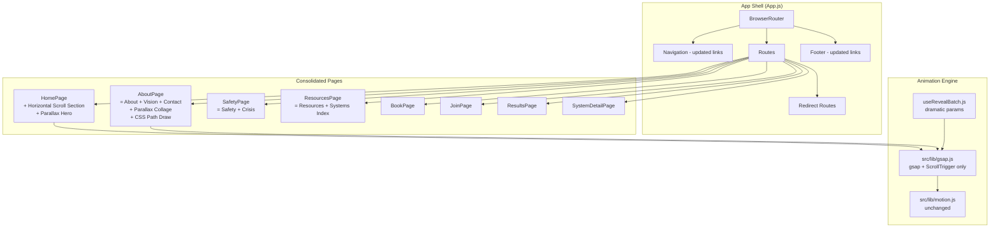

# Design Document

## Overview

This design realizes the **Page Consolidation and Animations** feature, which performs two coordinated changes to the Malumz frontend:

1. **Page consolidation** — Merges 12 pages down to 7 (plus 1 sub-route) by combining About+Vision+Contact → AboutPage, Crisis+Safety → SafetyPage, and Resources+Systems → ResourcesPage. Removed routes get redirects. Redundant content is aggressively trimmed during merges.

2. **Animation overhaul** — Removes all premium GSAP plugin dependencies (SplitText, DrawSVGPlugin, Flip, MorphSVGPlugin) and replaces them with prominent, visible scroll animations using only the free GSAP core + ScrollTrigger. The new animation vocabulary consists of parallax layers, dramatic staggered reveals, and a horizontal scroll section.

### Key Design Decisions and Rationales

1. **Free GSAP only.** Premium plugins were loaded via try/catch and silently failed, producing broken animations. Removing them entirely and building on gsap core + ScrollTrigger guarantees every animation works reliably without license dependencies.

2. **Redirects via `<Navigate>` for removed routes.** Using React Router's `<Navigate replace>` component for `/vision`, `/contact`, `/crisis`, and `/systems` ensures bookmarks and external links continue working while the route tree shrinks.

3. **More dramatic reveal parameters.** The current reveal (`y:50, scale:0.96`) is subtle. The new parameters (`y:120, scale:0.85, duration:1.0, stagger:0.15`) make animations prominently visible — the primary goal of this feature.

4. **Horizontal scroll for Six Trainers.** A pinned horizontal scroll section replaces the current TrainerSpotlight pinned scrub. This is a simpler, more reliable pattern that doesn't depend on complex timeline math and provides a distinctive browsing experience.

5. **CSS stroke-dasharray for path draw.** Replacing DrawSVGPlugin with native CSS `stroke-dasharray`/`stroke-dashoffset` animated via ScrollTrigger achieves the same visual effect with zero plugin dependency.

6. **Content trimming during merges.** When pages merge, duplicate content is removed rather than concatenated. The more detailed version of overlapping content survives; the shorter duplicate is cut.

### Scope

- **In scope:** Route consolidation, redirect setup, navigation/footer link updates, premium plugin removal, gsap.js simplification, parallax layers, dramatic staggered reveals, horizontal scroll section, CSS-based SVG path draw, counter preservation, whole-element text reveals, content deduplication, reduced-motion fallbacks, animation cleanup.
- **Out of scope:** Backend changes, new page content creation, design token changes, typography changes, asset module changes, cursor component changes, PageTransition component changes.

---

## Architecture

### Route Structure (After)

```
/                   → HomePage
/book               → BookPage
/join               → JoinPage
/safety             → SafetyPage (merged Crisis + Safety)
/resources          → ResourcesPage (merged Resources + Systems index)
/systems/:slug      → SystemDetailPage (preserved sub-route)
/about              → AboutPage (merged About + Vision + Contact)
/results            → ResultsPage
/vision             → <Navigate to="/about" replace />
/contact            → <Navigate to="/about" replace />
/crisis             → <Navigate to="/safety" replace />
/systems            → <Navigate to="/resources" replace />  (exact match only)
```

### High-Level Architecture Diagram



### Module Changes

```
frontend/src/
├── App.js                    (modified: remove old routes, add redirects)
├── lib/
│   ├── gsap.js               (modified: remove premium plugins, export only gsap + ScrollTrigger)
│   ├── motion.js             (unchanged)
│   ├── useRevealBatch.js     (modified: dramatic parameters)
│   ├── useRouteScrollRefresh.js  (unchanged)
│   └── useResizeRefreshDebounce.js (unchanged)
├── components/
│   ├── Navigation.js         (modified: consolidated link set)
│   ├── Footer.js             (modified: consolidated link set)
│   └── home/
│       ├── HeroSection.js    (modified: add parallax layer, remove SplitText)
│       ├── TrainerConnector.js (modified: remove DrawSVG, use CSS path draw)
│       ├── TrainerSpotlight.js (removed or replaced by HorizontalTrainers.js)
│       └── HorizontalTrainers.js (new: horizontal scroll section)
├── pages/
│   ├── HomePage.js           (modified: use HorizontalTrainers instead of TrainerSpotlight)
│   ├── AboutPage.js          (modified: merge Vision + Contact content, parallax collage, CSS path draw)
│   ├── SafetyPage.js         (modified: merge Crisis content at top)
│   ├── ResourcesPage.js      (modified: merge Systems index content)
│   ├── VisionPage.js         (deleted)
│   ├── ContactPage.js        (deleted)
│   ├── CrisisPage.js         (deleted)
│   └── SystemsPage.js        (deleted)
```

---

## Components and Interfaces

### 1. `src/lib/gsap.js` — Simplified Animation Engine

```js
import { gsap } from "gsap";
import { ScrollTrigger } from "gsap/ScrollTrigger";

gsap.registerPlugin(ScrollTrigger);
ScrollTrigger.defaults({ markers: false });
ScrollTrigger.config({ limitCallbacks: true });

export { gsap, ScrollTrigger };
```

All premium plugin imports, try/catch blocks, and conditional registration are removed. Components that previously consumed `SplitText`, `DrawSVGPlugin`, `Flip`, or `MorphSVGPlugin` from this module are refactored to use alternative approaches.

### 2. `useRevealBatch.js` — Dramatic Staggered Reveals

Updated configuration constants:

| Parameter | Old Value | New Value |
|-----------|-----------|-----------|
| Initial y | 50 | 120 |
| Initial scale | 0.96 | 0.85 |
| Duration | 0.8 | 1.0 |
| Stagger | 0.1 | 0.15 |
| Start | "top 88%" | "top 85%" |

The reduced-motion branch remains unchanged: elements are set to their final position immediately (`opacity:1, y:0, scale:1`) with no animation.

### 3. `HorizontalTrainers.js` — Horizontal Scroll Section (New)

**Props:**

| Prop | Type | Description |
|------|------|-------------|
| `trainers` | `Array<{ name: string, description: string, icon: Component }>` | The six trainer cards to display |

**Behavior:**

- Renders a viewport-height container with an inner horizontal track containing 6 trainer cards.
- On desktop (≥768px) with no reduced motion: pins the container and scrubs horizontal translation of the inner track as the user scrolls vertically.
- ScrollTrigger config: `pin: true`, `scrub: 1`, `end: () => "+=" + (trackWidth - viewportWidth)`.
- On mobile (<768px) or reduced motion: renders as a standard vertical card stack with no pinning.
- All cards carry the `.gs-reveal` class for staggered reveal participation in the vertical fallback.

**Implementation pattern:**

```js
useGSAP(() => {
  const mm = gsap.matchMedia();
  mm.add({
    isDesktop: "(min-width: 768px) and (prefers-reduced-motion: no-preference)",
    isMobile: "(max-width: 767px), (prefers-reduced-motion: reduce)"
  }, (context) => {
    const { isDesktop } = context.conditions;
    if (isDesktop) {
      const trackWidth = trackRef.current.scrollWidth;
      const viewportWidth = window.innerWidth;
      gsap.to(trackRef.current, {
        x: -(trackWidth - viewportWidth),
        ease: "none",
        scrollTrigger: {
          trigger: containerRef.current,
          pin: true,
          scrub: 1,
          end: () => "+=" + (trackWidth - viewportWidth),
        }
      });
    }
  });
}, { scope: containerRef });
```

### 4. Parallax Layers

**HomePage Hero Parallax:**

A background decorative element (e.g., a large blurred shape or image) translates at 0.5× scroll rate:

```js
gsap.to(parallaxEl, {
  y: -100,  // moves 100px over the scroll range (at least 50px difference)
  ease: "none",
  scrollTrigger: {
    trigger: heroSection,
    start: "top top",
    end: "bottom top",
    scrub: true,
  }
});
```

**AboutPage Collage Parallax:**

Left-column images translate at `y: -60` and right-column images at `y: -30` (or vice versa), creating differential movement:

```js
// Left column images
gsap.to(leftImages, {
  y: -60,
  ease: "none",
  scrollTrigger: { trigger: collageSection, start: "top bottom", end: "bottom top", scrub: true }
});
// Right column images
gsap.to(rightImages, {
  y: -30,
  ease: "none",
  scrollTrigger: { trigger: collageSection, start: "top bottom", end: "bottom top", scrub: true }
});
```

**Reduced motion:** All parallax tweens live inside `gsap.matchMedia().add("(prefers-reduced-motion: no-preference)", ...)`. The reduce branch does nothing — elements stay at their CSS-authored positions.

### 5. CSS-Based SVG Path Draw (Vision Roadmap Timeline)

Replaces the DrawSVGPlugin approach with native CSS properties:

```js
useGSAP(() => {
  const path = lineRef.current;
  const pathLength = path.getTotalLength();
  
  // Set initial state via CSS
  gsap.set(path, {
    strokeDasharray: pathLength,
    strokeDashoffset: pathLength,
  });

  const mm = gsap.matchMedia();
  mm.add("(prefers-reduced-motion: no-preference)", () => {
    gsap.to(path, {
      strokeDashoffset: 0,
      ease: "none",
      scrollTrigger: {
        trigger: timelineSection,
        start: "top center",
        end: "bottom center",
        scrub: true,
      }
    });
  });
  mm.add("(prefers-reduced-motion: reduce)", () => {
    gsap.set(path, { strokeDashoffset: 0 });
  });
}, { scope: timelineRef });
```

### 6. Text Reveal Without SplitText

The AboutPage pull-quote paragraphs now animate as whole elements:

```js
gsap.set(paragraphEls, { opacity: 0, y: 40 });
ScrollTrigger.batch(paragraphEls, {
  start: "top 70%",
  once: true,
  onEnter: (batch) => gsap.to(batch, {
    opacity: 1,
    y: 0,
    duration: 0.8,
    stagger: 0.2,
    ease: "power3.out",
  }),
});
```

No SplitText, no per-word DOM manipulation. The reduced-motion branch sets paragraphs to `opacity:1, y:0` immediately.

### 7. Navigation Component — Updated Link Set

```js
const navLinks = [
  { name: 'Home', path: '/' },
  { name: 'The Book', path: '/book' },
  { name: 'Start a Circle', path: '/join' },
  { name: 'Learn', children: [
    { name: 'Resources', path: '/resources' },
    { name: 'Results', path: '/results' },
  ]},
  { name: 'About', path: '/about' },
  { name: 'Safety', path: '/safety' },
];
```

The "I Need Help Now" crisis button changes its `to` from `/crisis` to `/safety`.

### 8. App.js Route Configuration

```jsx
<Routes>
  <Route path="/" element={<HomePage />} />
  <Route path="/book" element={<BookPage />} />
  <Route path="/join" element={<JoinPage />} />
  <Route path="/safety" element={<SafetyPage />} />
  <Route path="/resources" element={<ResourcesPage />} />
  <Route path="/systems/:slug" element={<SystemDetailPage />} />
  <Route path="/about" element={<AboutPage />} />
  <Route path="/results" element={<ResultsPage />} />
  {/* Redirects for removed routes */}
  <Route path="/vision" element={<Navigate to="/about" replace />} />
  <Route path="/contact" element={<Navigate to="/about" replace />} />
  <Route path="/crisis" element={<Navigate to="/safety" replace />} />
  <Route path="/systems" element={<Navigate to="/resources" replace />} />
</Routes>
```

### 9. Merged Page Compositions

**AboutPage sections (in order):**
1. Hero title band (preserved)
2. Counter band with pull-quote paragraphs (preserved, SplitText removed)
3. Editorial collage with parallax (enhanced)
4. Timeline — "The Story" (preserved from About)
5. Vision roadmap timeline with CSS path draw (moved from VisionPage)
6. Infrastructure vision (moved from VisionPage, Phase 2/3 cards removed)
7. Malumz Network (moved from VisionPage)
8. Policy recommendations (moved from VisionPage)
9. Contact form (moved from ContactPage)

**SafetyPage sections (in order):**
1. Crisis hero — emergency CTA + Lifeline number (moved from CrisisPage, placed first)
2. Emergency numbers grid (moved from CrisisPage)
3. Provincial resources (moved from CrisisPage)
4. The Non-Negotiable (preserved from Safety)
5. Trained Tyrant Profile (preserved from Safety)
6. Silent Exclusion Guide (preserved from Safety)
7. Facilitator Vetting Checklist (preserved from Safety)
8. Anonymous Report Form (preserved from Safety)

**ResourcesPage sections (in order):**
1. Hero (preserved from Resources)
2. Voice Note Prompts (preserved from Resources)
3. Printable PDFs (preserved from Resources)
4. Special Guides (preserved from Resources)
5. System Guides index with trainer colour pills (moved from SystemsPage)

---

## Data Models

No new data models are introduced. Existing page-level data constants (`emergencyNumbers`, `provinces`, `tyrantSigns`, `vettingChecklist`, `systems`, `trainerColors`, `voiceNotePrompts`, `printablePDFs`, `specialGuides`, `timelineEvents`, `TIMELINE`, `PULL_QUOTE_PARAGRAPHS`, `COLLAGE_ITEMS`, `sixTrainers`) are relocated to their new host pages but preserved byte-for-byte.

The contact form state shape is unchanged:
```js
{ name: string, email: string, subject: string, message: string }
```

The safety report form state shape is unchanged:
```js
{ message: string }
```

---

## Correctness Properties

*A property is a characteristic or behavior that should hold true across all valid executions of a system — essentially, a formal statement about what the system should do. Properties serve as the bridge between human-readable specifications and machine-verifiable correctness guarantees.*

### Property 1: No Dead Links to Removed Routes

*For any* rendered page in the application, all internal anchor elements and Link components SHALL NOT point to `/vision`, `/contact`, `/crisis`, or `/systems` (exact path match, excluding `/systems/:slug` prefix matches).

**Validates: Requirements 4.4**

### Property 2: Parallax Y-Translation Range

*For any* element configured with a ScrollTrigger scrub-based parallax animation, the absolute difference between the start and end y-translation values SHALL be at least 50 pixels.

**Validates: Requirements 6.3**

### Property 3: Reduced Motion Disables Parallax

*For any* parallax-configured element, when `prefers-reduced-motion: reduce` is active, the element SHALL have no y-translation applied (remains at its static CSS position with y offset of 0).

**Validates: Requirements 6.4**

### Property 4: Reduced Motion Shows Reveals Immediately

*For any* element with the `.gs-reveal` class, when `prefers-reduced-motion: reduce` is active, the element SHALL be rendered at `opacity: 1`, `y: 0`, `scale: 1` without any animation delay or transition.

**Validates: Requirements 7.4**

### Property 5: Horizontal Scroll Distance Invariant

*For any* viewport width and inner track width where the horizontal scroll section is active (viewport ≥ 768px, no reduced motion), the ScrollTrigger scroll distance SHALL equal the track's scrollable width minus one viewport width.

**Validates: Requirements 8.3**

### Property 6: No Duplicate Content on Merged Pages

*For any* merged page (AboutPage, SafetyPage, ResourcesPage), no substantive paragraph text (≥ 20 characters) SHALL appear more than once within the same page's rendered output.

**Validates: Requirements 13.5**

---

## Error Handling

### Route Redirects
- Unknown routes that previously resolved to removed pages (`/vision`, `/contact`, `/crisis`, `/systems`) are handled by `<Navigate replace>` components that redirect to the consolidated page. No 404 is shown for these paths.
- The `/systems/:slug` sub-route is preserved; if a slug doesn't match any system, the existing SystemDetailPage handles the not-found case.

### Animation Failures
- If ScrollTrigger fails to initialize (e.g., in a test environment without DOM measurements), elements remain at their CSS-authored positions. The `.gs-reveal` class sets `opacity:0` via CSS, but a `<noscript>` fallback style and the reduced-motion CSS override ensure content is visible.
- If `path.getTotalLength()` returns 0 or throws (e.g., in JSDOM), the SVG path draw animation is skipped and the path renders fully drawn.
- If the horizontal scroll section cannot measure track width (SSR or test), it falls back to the vertical stack layout.

### Form Submissions
- The contact form and safety report form preserve their existing error handling: try/catch around `submitContact()` with a user-facing alert on failure.
- Form state is preserved on error so users don't lose their input.

### Image Loading
- The existing `onError` handlers and placeholder fallbacks for collage/timeline images are preserved in the merged AboutPage.

---

## Testing Strategy

### Unit Tests (Example-Based)

Unit tests verify specific behaviors with concrete examples:

- **Route configuration:** Verify the route tree contains exactly the expected paths and redirects render correctly.
- **Navigation links:** Render Navigation and assert the correct link set is present.
- **Page section ordering:** Render each merged page and verify sections appear in the specified order.
- **Content absence:** Verify removed sections (e.g., "The Mission", "For Men in Crisis", "Need the Expanded System Guides?") do not appear.
- **Animation parameters:** Verify the reveal batch uses `y:120`, `scale:0.85`, `duration:1.0`, `stagger:0.15`, `start:"top 85%"`.
- **gsap.js exports:** Verify only `gsap` and `ScrollTrigger` are exported; no premium plugins.
- **Reduced motion fallbacks:** With mocked `matchMedia`, verify elements are set to final state immediately.
- **Horizontal scroll config:** Verify pin, scrub, and responsive fallback behavior.
- **SVG path draw:** Verify stroke-dasharray/stroke-dashoffset are set and animated.

### Property-Based Tests (fast-check)

Property-based tests verify universal properties across generated inputs. The project already uses `fast-check` (v3.23.2).

**Configuration:**
- Minimum 100 iterations per property test
- Each test tagged with: `Feature: page-consolidation-and-animations, Property {N}: {title}`

**Properties to implement:**

1. **No Dead Links** — Generate random navigation through all app pages, collect all rendered `<a>` and `<Link>` hrefs, assert none match removed routes.
2. **Parallax Y-Range** — Generate random parallax configurations (start/end y values), verify the absolute difference is ≥ 50px.
3. **Reduced Motion Disables Parallax** — Generate random parallax element states, apply reduced-motion logic, verify y=0.
4. **Reduced Motion Shows Reveals** — Generate random .gs-reveal element sets, apply reduced-motion logic, verify opacity:1, y:0, scale:1.
5. **Horizontal Scroll Distance** — Generate random track widths and viewport widths, verify scroll distance = trackWidth - viewportWidth.
6. **No Duplicate Content** — Generate page renders, extract paragraph text, verify no duplicates.

### Integration Tests

- **Redirect behavior:** Navigate to each removed route and verify the browser ends up at the correct consolidated page.
- **Full page render:** Each consolidated page renders without errors and contains all expected sections.
- **Animation lifecycle:** Mount a page, verify ScrollTriggers are created; navigate away, verify they are cleaned up.

### Smoke Tests

- **Build succeeds:** `craco build` completes without errors.
- **No premium plugin imports:** Grep codebase for banned import paths, assert zero matches.
- **gsap.js registers only ScrollTrigger:** Import the module and verify `gsap.plugins` state.
